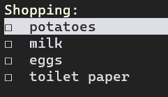

# Ndo - an ncurses todo application

[](https://app.codacy.com/gh/mecaneer23/Ndo/dashboard?utm_source=gh&utm_medium=referral&utm_content=&utm_campaign=Badge_grade)

A curses implementation of a todo list helper. Most of the keybindings are similar to Vim-bindings so Vim users should feel relatively comfortable.



## OS Support

- Ndo is optimized for Linux, as most Vim users use Linux.
- MacOS is also supported however some keyboard shortcuts use different modifier keys.
- In Windows, general editing is available using the following [external package](#curses-for-windows), although some keyboard shortcuts might not work.

## Setup

### Magnify, copy, and paste

```bash
pip install pyfiglet pyperclip
```

### Curses for Windows

```bash
pip install windows-curses
```

## Running

```bash
python3 todo.py [options] [filename]
```

Or with Docker:

```bash
./docker_build.sh
./docker_run.sh filename
```

## Flags

Positional arguments:

| Argument | Description                                                          |
| -------- | -------------------------------------------------------------------- |
| filename | Provide a filename to store the todo list in. Default is `todo.txt`. |

Options:

| Option                                                         | Description                                                                                                                                           |
| -------------------------------------------------------------- | ----------------------------------------------------------------------------------------------------------------------------------------------------- |
| --bullet-display, -b                                           | Boolean: determine if Todos are displayed with a bullet point rather than a checkbox. Default is `False`.                                             |
| --enumerate, -e                                                | Boolean: determines if todos are numbered when printed or not. Default is `False`.                                                                    |
| --ui {curses,ansi,tkinter,none}, -g {curses,ansi,tkinter,none} | UiType: determine how todos should be rendered. Default is `ansi`. If `none` is passed, print state of a todolist to stdout without a user interface. |
| --help, -h                                                     | Show this help message and exit.                                                                                                                      |
| --help-file HELP_FILE                                          | Allows passing alternate file to specify help menu. Default is `README.md`.                                                                           |
| --indentation-level INDENTATION_LEVEL, -i INDENTATION_LEVEL    | Allows specification of indentation level. Default is `2`.                                                                                            |
| --relative-enumeration, -r                                     | Boolean: determines if todos are numbered when printed. Numbers relatively rather than absolutely. Default is `False`.                                |
| --rename, -n                                                   | Boolean: if true, show prompt to rename file, rename file to input, and exit. Default is `False`.                                                     |
| --simple-boxes, -x                                             | Boolean: allow rendering simpler checkboxes if terminal doesn't support default ascii checkboxes. Default is `False`.                                 |
| --strikethrough, -s                                            | Boolean: strikethrough completed todos - option to disable because some terminals don't support strikethroughs. Default is `False`.                   |
| --title TITLE, -t TITLE                                        | Allows passing alternate header. Default is `filename`.                                                                                               |

## Controls (Normal mode)

| Key (arranged alphabetically)                                            | Description                         |
| ------------------------------------------------------------------------ | ----------------------------------- |
| <kbd>-</kbd>                                                             | Insert blank line                   |
| <kbd>/</kbd>                                                             | Search for a sequence               |
| <kbd>Alt</kbd>+<kbd>g</kbd>/<kbd>Alt</kbd>+<kbd>Shift</kbd>+<kbd>g</kbd> | Select all todos above/below        |
| <kbd>Alt</kbd>+<kbd>k</kbd>/<kbd>j</kbd>                                 | Move todo up and down               |
| <kbd>Backspace</kbd>                                                     | Combine with previous todo          |
| <kbd>Ctrl</kbd>+<kbd>a</kbd>                                             | Select all todos                    |
| <kbd>Ctrl</kbd>+<kbd>r</kbd>                                             | Redo change                         |
| <kbd>Ctrl</kbd>+<kbd>x</kbd>, <kbd>k</kbd>                               | Toggle `toggle` and `entry` modes   |
| <kbd>Delete</kbd>                                                        | Toggle between `Todo` and `Note`    |
| <kbd>Enter</kbd>                                                         | Toggle a todo as completed          |
| Numbers                                                                  | Move a number of lines              |
| <kbd>Shift</kbd>+<kbd>k</kbd>/<kbd>j</kbd>                               | Select/deselect multiple todos      |
| <kbd>Shift</kbd>+<kbd>o</kbd>                                            | Add a todo on current line          |
| <kbd>Tab</kbd>/<kbd>Shift</kbd>+<kbd>Tab</kbd>                           | Indent/unindent selected todo       |
| <kbd>a</kbd>                                                             | Display selected todo as an alert   |
| <kbd>b</kbd>                                                             | Make selected todo bigger (magnify) |
| <kbd>c</kbd>                                                             | Change selected todo color          |
| <kbd>d</kbd>                                                             | Remove selected todo                |
| <kbd>g</kbd>/<kbd>Shift</kbd>+<kbd>g</kbd>                               | Jump to top/bottom of todos         |
| <kbd>h</kbd>                                                             | Show a list of controls             |
| <kbd>i</kbd>                                                             | Edit an existing todo               |
| <kbd>k</kbd>/<kbd>j</kbd>                                                | Move cursor up and down             |
| <kbd>o</kbd>                                                             | Add a new todo                      |
| <kbd>n</kbd>                                                             | Move to next search term location   |
| <kbd>p</kbd>                                                             | New todo from clipboard             |
| <kbd>q</kbd>, <kbd>Ctrl</kbd>+<kbd>c</kbd>, <kbd>Esc</kbd>               | Quit                                |
| <kbd>s</kbd>                                                             | Sort top-level todos various ways   |
| <kbd>u</kbd>                                                             | Undo change                         |
| <kbd>y</kbd>                                                             | Copy todo to clipboard              |

## Input box controls (Input mode)

| Key or shortcut                                                     | Description                          |
| ------------------------------------------------------------------- | ------------------------------------ |
| Letters, numbers, punctuation, etc.                                 | Add character to textbox             |
| <kbd>Enter</kbd>                                                    | Return to full list, saving changes  |
| <kbd>Ctrl</kbd>+<kbd>c</kbd>, <kbd>Esc</kbd>                        | Return to full list without saving   |
| <kbd>Left</kbd>/<kbd>Right</kbd>                                    | Move the cursor left/right one space |
| <kbd>Ctrl</kbd>+<kbd>Left</kbd>/<kbd>Ctrl</kbd>+<kbd>Right</kbd>    | Move the cursor left/right one word  |
| <kbd>Home</kbd>                                                     | Move cursor to left end of textbox   |
| <kbd>End</kbd>                                                      | Move cursor to right end of textbox  |
| <kbd>Backspace</kbd>                                                | Delete the character left of cursor  |
| <kbd>Delete</kbd>                                                   | Delete the character right of cursor |
| <kbd>Ctrl</kbd>+<kbd>Backspace</kbd>                                | Delete the word left of cursor       |
| <kbd>Ctrl</kbd>+<kbd>Delete</kbd>                                   | Delete the word right of cursor      |
| <kbd>Tab</kbd>                                                      | Indent line, to the right            |
| <kbd>Shift</kbd>+<kbd>Tab</kbd>                                     | De-indent line, to the left          |
| <kbd>Shift</kbd>+<kbd>Delete</kbd>/<kbd>Alt</kbd>+<kbd>Delete</kbd> | Toggle whether line has checkbox     |
| <kbd>Ctrl</kbd>+<kbd>x</kbd>, <kbd>k</kbd>                          | Toggle `toggle` and `entry` modes    |
| <kbd>Down</kbd>                                                     | Split line at cursor                 |
| <kbd>Alt</kbd>+<kbd>h</kbd>                                         | Show a list of controls              |

## View a todo list online

Go to [this link](https://mecaneer23.github.io/Ndo/web-display) and upload your file

## Contributing

Use the following linters and formatters:

### Python files

- pylint
- black
- ruff
- mypy
- vulture

### Markdown files

- markdownlint

### Testing

```bash
pytest test
```

## Troubleshooting

### Docker error

`Cannot connect to the Docker daemon at ... Is the Docker daemon running?`

```bash
systemctl start docker
```
